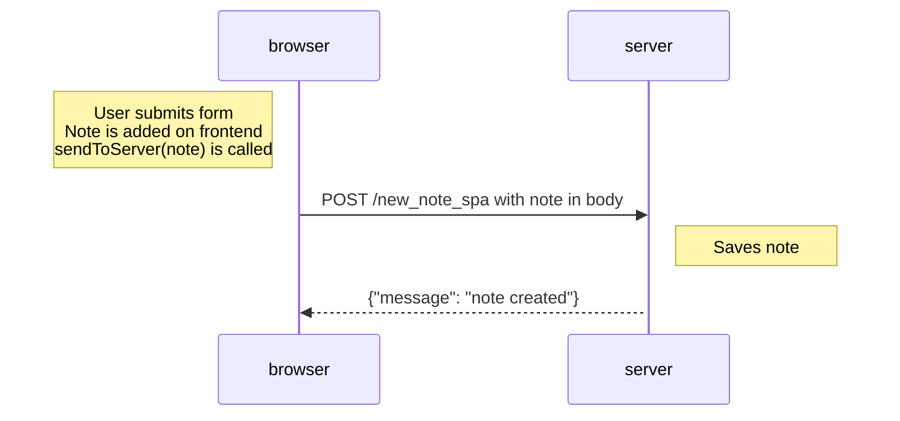

```mermaid
sequenceDiagram
  participant browser
  participant server

  Note left of browser:User submits form <br/> Note is added on frontend <br/> sendToServer(note) is called
  browser->>server:POST /new_note_spa with note in body
  activate server
  Note right of server:Saves note
  server-->>browser:{"message": "note created"}
```
