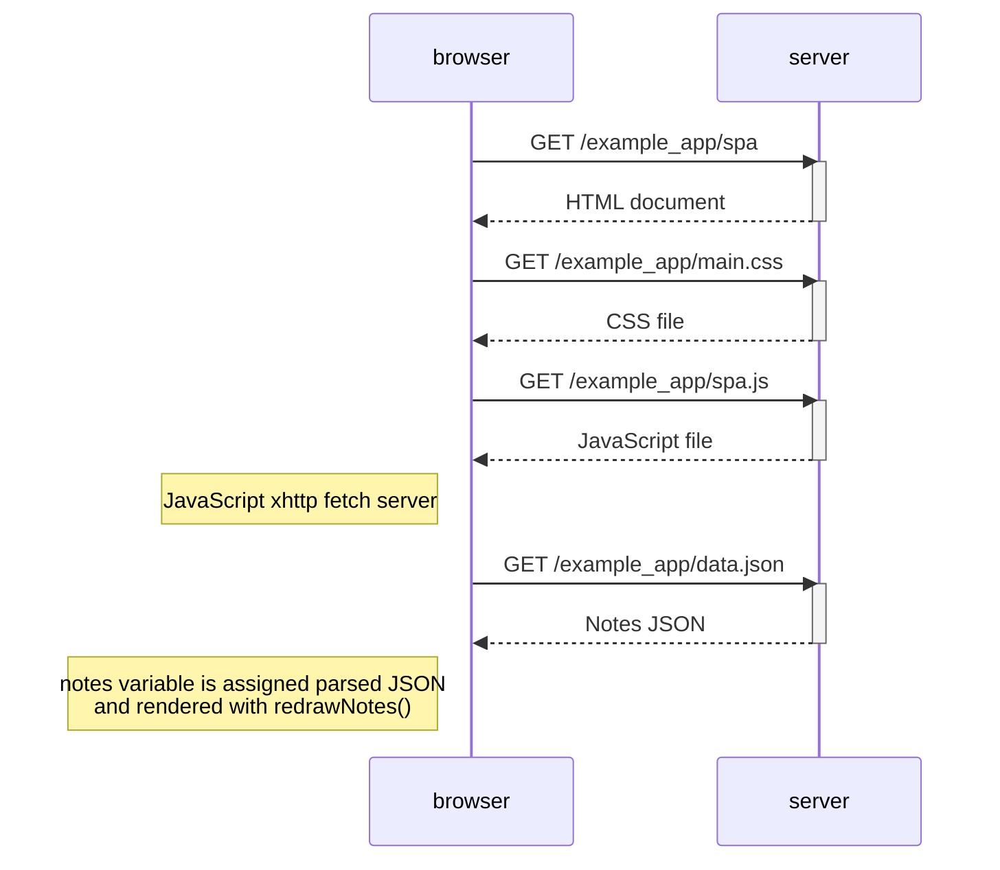

```mermaid
sequenceDiagram
  participant browser
  participant server

  browser->>server:GET /example_app/spa
  activate server
  server-->>browser:HTML document
  deactivate server

  browser->>server:GET /example_app/main.css
  activate server
  server-->>browser:CSS file
  deactivate server

  browser->>server:GET /example_app/spa.js
  activate server
  server-->>browser:JavaScript file
  deactivate server

  Note left of browser:JavaScript xhttp fetch server
  browser->>server:GET /example_app/data.json
  activate server
  server-->>browser:Notes JSON
  deactivate server

  Note left of browser:notes variable is assigned parsed JSON <br/> and rendered with redrawNotes()
```
